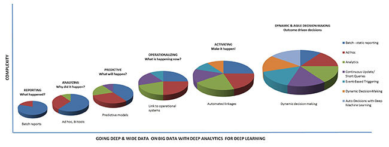
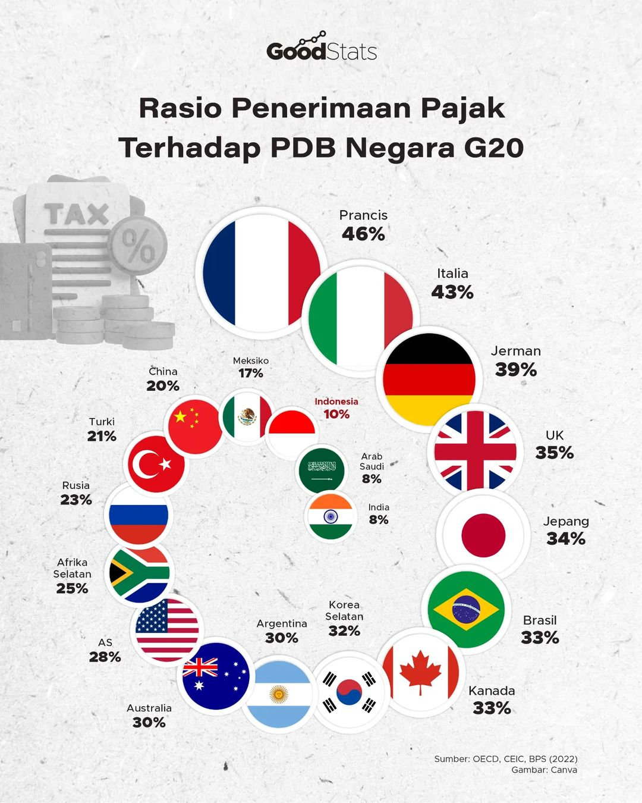
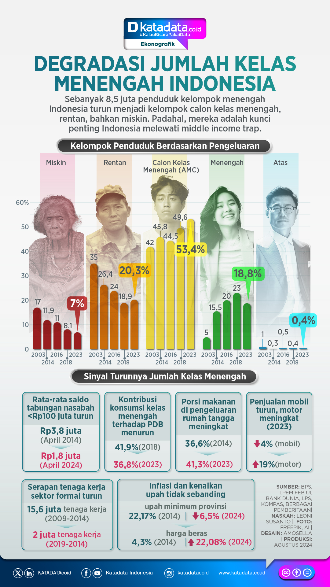

# TUGAS 2
TUGAS Visualisasi Data dan Informasi
Nama : Virdio Samuel Saragih

NIM : 122450124

Dosen Pengampu : Ahmad Luky Ramdani S.Komp., M.Kom

# Contoh Visualisasi Buruk

### Why Do So Many Analytics Projects Fail?

https://viz.wtf/post/171171167398/from-an-article-subtitled-why-do-so-many

Contoh diatas adalah contoh visualisasi yang buruk. Terlihat bahwa penulis ingin membandingkan antara 1 topik dan topik lainnya dalam sebuah pie chart dan kordinat xy. Tetapi tidak ada penjelasan terkait rentang x dan y dalam kordinat, juga cara membaca pie chart dalam kordinat sehingga informasi yang ada tidak tersampaikan dengan jelas.

4 kunci
- [ ] ~Telling stories with data~
- [ ] ~Maintain simplicity~
- [ ] ~Highlight Key messages~
- [ ] ~Maintain consistency~

## Why People Keep Dogs in China?

https://www.reddit.com/r/dataisugly/comments/auz6dm/why_people_keep_donut_charts_that_scale_to_1955/

Contoh diatas adalah contoh visualisasi yang buruk. Grafik diatas ingin mengetahui apa saja tujan orang China memeilhara anjing berikut persentasenya. Kesalahan grafik diatas adalah besaran persentase yang ambigu tiap bagiannya, jika ditotal maka hasilnya adalah 195,5%. Seharusnya besaran total persentase adalah 100%.

4 kunci
- [x] Telling stories with data
- [x] Maintain simplicity
- [ ] ~Highlight Key messages~
- [ ] ~Maintain consistency~

# Contoh Visualisasi Bagus

## Rasio Penerimaan Pajak Terhadap PDB Negara G20

https://goodstats.id/article/rasio-utang-negara-g20-tahun-2023-indonesia-terendah-ketiga-jom7X

Contoh diatas adalah contoh visualisasi yang bagus, visualisasi diatas menjelaskan terkait rasio utang negara yang tergabung kedalam G20 terhadap PDB pada tahun 2023, termasuk negara Indonesia. Visualisasi diatas bagus karena selain mencantumkan persentase, juga menyesuaikan ukuran bendera negara dengan besaran persentase sehingga pesan tersampaikan dengan mudah.

4 kunci
- [x] Telling stories with data
- [x] Maintain simplicity
- [x] Highlight Key messages
- [x] ~Maintain consistency~

## Degradasi Jumlah Kelas Menengah Indonesia

https://katadata.co.id/infografik/66cfdafdd198f/infografik-degradasi-jumlah-kelas-menengah-indonesia

Contoh diatas adalah contoh visualisasi yang bagus, visualisasi diatas terfokus kepada permasalahan persentase kelas menengah yang semakin turun dan menjadi calon kelas menengah, rentan, dan miskin. Visualisasi diatas selain mencantumkan barplot dan persentase, juga mencantumkan ilustrasi foto yang sangat membantu untuk menggambarkan kondisi dilapangan. Terdapat visualisasi lain yang berjudul "Sinya Turunnya Jumlah Kelas Menengah", ini juga membantu untuk mempertegas dari grafik barplot sebelumnya karena terdapat faktor-faktor yang menunjukkan kelas menengah.

4 kunci
- [x] Telling stories with data
- [x] Maintain simplicity
- [x] Highlight Key messages
- [x] Maintain consistency

